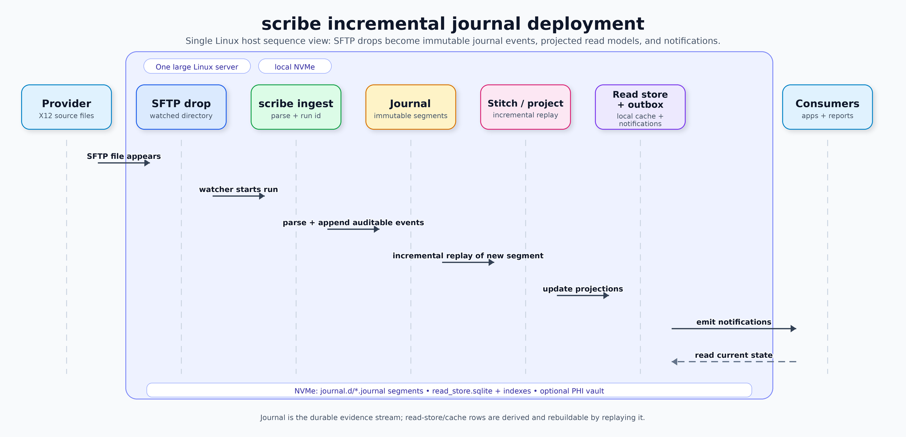

# FAQ

## How do we match 837 claims to 835 remits?

Claim matching starts with the claim id shared by the X12 documents. The 837
`CLM01` value and the 835 `CLP01` value are treated as the same claim id
namespace. In the default non-PHI path, that id is tokenised and the aggregate
id is based on the token:

```text
claim:<tokenised CLM01/CLP01>
```

When an 835 includes `CLP07`, scribe also records it as the payer claim control
number. That value is indexed as another durable key for the same claim
aggregate, so later journal events can find the aggregate by either the original
claim id or the payer control number.

Service lines are matched inside the claim aggregate. The stitcher first tries
procedure code plus charge amount. If matching service dates are present, the
line records `match_method: "procedure_charge_date"`. Without a date match it
records `procedure_charge`. If procedure and charge do not identify a submitted
line, the stitcher falls back to service line order. A remit-only line is kept
with `match_method: "created_from_remittance"` instead of being dropped.

## How do we stitch?

Ingest writes small, tokenised journal events with source drop, run, control
number, segment, and byte-offset provenance. Stitching reads those journal
events and materializes aggregate versions.

There are two stitch modes:

- Full replay: omit `--incremental`. The stitcher reads the supplied journal
  file or journal directory and rebuilds aggregate output from the event stream.
- Incremental append: pass `--incremental --read-store store.sqlite`. The
  supplied journal is treated as the new source-drop segment. The stitcher
  indexes the new events, marks affected aggregate ids dirty, hydrates only
  those aggregates from the read store, applies the new events, and writes the
  next aggregate versions.

The NDJSON written by `--out` is an inspection/debug stream for the versions
changed by that run. Applications should read the read-store tables for durable
latest and versioned aggregate state. `--notify-out` is the outbox handoff for
aggregate-version notifications.

## What is the deployment shape?

`scribe` is a CLI tool built for Unix-style composition: run it in shell
pipelines, cron or batch jobs, serverless triggers, containers, schedulers, or
small long-lived workers. The diagram below is one practical deployment shape,
not a required topology.

That shape is one large Linux host with local NVMe storage. A watched SFTP drop
receives provider X12 files, a watcher starts a `scribe ingest` run, and ingest
parses the file into a new immutable `.journal` segment with a run id and
source-drop provenance.

After that, `scribe stitch` and `scribe project` run incrementally against the
new segment. They update a local read store, indexes, latest aggregate rows,
and the outbox. Consumers read current state from the read store and receive
notifications from the outbox; they do not read raw X12 files directly.



The journal remains the durable evidence stream. The read store, indexes, and
notification state are derived cache/materialization surfaces that can be
rebuilt by replaying journal segments. A PHI vault, when used, sits alongside
the normal stores rather than inside the default non-PHI path.

## Why have a journal?

The journal is the evidence store. It keeps the parsed facts as an append-only
stream with source drop, run, control number, segment, and byte-offset context.
That gives later processors one stable input for replay, audit, indexing,
aggregate rebuilds, balance projection, and debugging.

The read store is intentionally separate. It is the materialized lookup surface:
event indexes, aggregate keys, versioned snapshots, latest rows, and dirty
routing. If a read model is wrong or a new projection is needed, the journal is
the source to replay from.

## Why is the journal binary?

The binary format is a framed event stream, not a database. Each file has a
scribe journal header and length-prefixed records with typed fields and compact
field ids for common event names. That makes appends and reads simple in C,
lets readers skip or seek by stored record length, and keeps byte locators
stable for audit/index rows.

Text output still exists where it is useful: `parse` emits JSON for inspection,
and stitch/project commands can write NDJSON debug streams. The durable evidence
path uses the binary journal so normal processors do not depend on reparsing
large JSON dumps.

## How is PHI handled?

Default flows stay tokenised. Identifier-like values are hashed into stable
tokens by namespace, raw names and ids are omitted from normal read stores, and
aggregate keys use tokens.

When raw PHI is needed, use a separate PHI vault and an explicit
`--include-phi --phi-vault ...` workflow. The vault maps `namespace + token` to
the raw value so controlled readers can resolve it without making the normal
journal, aggregate store, or outbox PHI-bearing by default.

## Do 837 files need to be ingested in order?

No. The journal is append-only evidence, so source drops should usually be
ingested in arrival order. Matching uses stable domain keys from the X12
content, not local filenames or arrival position.

The normal claim lifecycle is still easiest to read when the 837 arrives before
the 835: the first stitch creates a claim-only aggregate version and the later
835 stitch adds adjudication as the next version. If an 835 arrives first, the
stitcher can create or update the same claim aggregate from `CLP01`; a later
837 with the same claim id will update that aggregate when it is stitched.

Ordering does affect version history. Out-of-order arrival can produce an
intermediate remit-only or claim-only version before the aggregate becomes
complete. For audit rebuilds, replay the complete journal explicitly; for normal
operations, use incremental stitch with the read store so later drops can find
and update earlier aggregate state by key.
