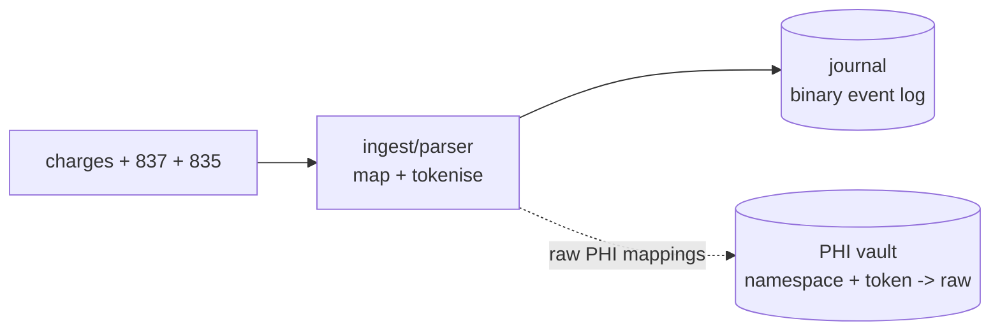
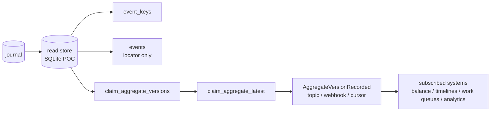

# scribe

Proof of concept for stitching provider charge context, 837 claims, and 835
remittances into versioned claim aggregates and ledger-style balance projections.

The main case study is a semi-synthetic stroke recovery encounter:

- Encounter: `ENC-SYN-STROKE-001`
- Patient: synthetic `ALEX REID`
- Story: CT without contrast, CT with contrast, MRI, rehab, neurology follow-up
- Fixtures:
  [tests/fixtures/stroke_encounter](https://github.com/AlexJReid/scribe/tree/main/tests/fixtures/stroke_encounter)

The PHI-looking values are fake synthetic data. The treatment shape reflects
stroke-related treatment I had in the UK; names, IDs, payer details, dates,
amounts, and EDI content are not real PHI.

## Model

Current proof of concept:

- Journal: immutable binary evidence stream
- PHI vault: separate resolver for `namespace + token -> raw`
- Indexes: claim, payer control, encounter, and event locator lookup
- Aggregate snapshot store: versioned claim state plus latest claim state

SQLite backs the vault, indexes, and snapshots in this proof of concept. It is
standing in for a managed database or document store.

### Benefits of this architecture

- Immutable journal for parsed 837/835 inputs
  - Events carry source file location references
- Early PHI split
  - Tokenised events can move through normal dev and analytics paths
  - Raw values stay in the vault
- Stable identifiers can be derived from composite input values
  - Stable key generation is deterministic HMAC-SHA256 with a secret
  - Key rules combine mapped fields, namespace, and origin-specific fallbacks
  - Pluggable mapping rules tailor matching by file origin
  - 837, 835, charges, and vendor variants can choose different key rules
- Journal reductions can answer state as of T
  - Chronologies and historic claim timelines become simple projections
- Pre-calculated claim snapshots are one read for consuming apps
  - Snapshots can be tokenised or PHI-containing
  - New versions can emit a small "new version exists" signal
  - Subscribers avoid fruitless polls and fetch only when there is work
  - Delivery can be a topic, webhook, or consumer cursor for nightly catch-up
- PHI can be modelled as a stream or separate read store
  - The main journal stays tokenised
  - Authorised apps may receive an encrypted, time-limited vault replica for local in-db joins
  - Replicating the vault proliferates sensitive data and needs careful control
  - Prefer generating a purpose-built PHI dataset as the app read store where possible
  - Or keep an audited API as the central vault for access control and lookup history
- `scribe` renders parsed 835/837 JSON and aggregate exports for exploration
- The C proof of concept is terse, compact, and extremely fast
  - It is a tiny executable, not a server
  - It can process large batches in milliseconds
- SQLite is a flexible stand-in for read stores and vaults

**Figure 1: ingest writes journal evidence and PHI vault mappings.**



**Figure 2: the read store indexes events and materialises aggregates.**



## Stroke demo

Create the journal and PHI vault:

```sh
build/scribe journal --out stroke.journal \
  --phi-vault stroke_phi_vault.sqlite \
  --charges tests/fixtures/stroke_encounter/charge_transactions.ndjson \
  --837 tests/fixtures/stroke_encounter/facility_837.edi \
  --837 tests/fixtures/stroke_encounter/professional_837.edi \
  --837 tests/fixtures/stroke_encounter/rehab_837.edi \
  --837 tests/fixtures/stroke_encounter/neurology_837.edi \
  --835 tests/fixtures/stroke_encounter/facility_835.edi \
  --835 tests/fixtures/stroke_encounter/professional_835.edi \
  --835 tests/fixtures/stroke_encounter/rehab_835.edi \
  --835 tests/fixtures/stroke_encounter/neurology_835.edi
```

Stitch into the read store:

```sh
build/scribe stitch \
  --journal stroke.journal \
  --encounter-id ENC-SYN-STROKE-001 \
  --read-store stroke_read_store.sqlite \
  --out stroke_aggregates.ndjson
```

`stroke_read_store.sqlite` contains:

- `event_keys`
- `events`
- `claim_aggregate_versions`
- `claim_aggregate_latest`

`stroke_aggregates.ndjson` is an inspection/export stream only.

PHI read store from the same tokenised journal:

```sh
build/scribe stitch \
  --journal stroke.journal \
  --encounter-id ENC-SYN-STROKE-001 \
  --read-store stroke_phi_read_store.sqlite \
  --phi-vault stroke_phi_vault.sqlite \
  --include-phi \
  --out stroke_phi_aggregates.ndjson
```

Optional: derive a ledger-style balance from the same journal:

```sh
build/scribe project --projection balance \
  --journal stroke.journal \
  --encounter-id ENC-SYN-STROKE-001 \
  --out stroke_balance.json
```

Expected current balance: `550.00`.

## Read store

Aggregates are in SQLite:

```sh
sqlite3 -header -column stroke_read_store.sqlite "
select aggregate_id, version, state_json
from claim_aggregate_latest
order by aggregate_id;
"
```

For a PHI read store:

```sh
sqlite3 -header -column stroke_phi_read_store.sqlite "
select aggregate_id, version,
       json_extract(state_json, '$.keys.claim_id') as claim_id,
       json_extract(state_json, '$.keys.patient_name') as patient_name
from claim_aggregate_latest
order by aggregate_id;
"
```

Version history:

```sh
sqlite3 -header -column stroke_read_store.sqlite "
select version, updated_by_event_id, source_drop_id, state_json
from claim_aggregate_versions
where aggregate_id = 'claim:8259c238232f9585e95fc8f45b0bb410'
order by version;
"
```

Journal locator lookup:

```sh
sqlite3 -header -column stroke_read_store.sqlite "
select ek.event_id, e.source_drop_id, e.event_type, e.segment_id,
       e.event_offset, e.event_length
from event_keys ek
join events e on e.event_id = ek.event_id
where ek.key_type = 'payer_claim_control_number'
  and ek.key_value = 'edf29f09740ab104da309e2b036e14d1';
"
```

`events` stores locators only, never payload or aggregate state:

```text
event_id, source_drop_id, event_type, segment_id, event_offset, event_length, checksum
```

## PHI

Default path is non-PHI:

- names omitted
- claim/control IDs tokenised
- aggregates keyed by tokens
- long text fields that may contain PHI can be tokenised the same way
- 837 `CLM01` and 835 `CLP01` share the `claim_id` namespace
- 835 `CLP07` uses `payer_claim_control_number`

```text
secret + namespace + raw value -> token
```

Token mechanics:

- HMAC-SHA256 gives deterministic keyed tokens for matching without raw PHI
- The HMAC input is `namespace + ":" + raw value`
- The key comes from `SCRIBE_TOKEN_KEY`
- The output token is the first 16 bytes of the digest as 32 lowercase hex chars
- Shortened tokens keep JSON, SQLite keys, and aggregate IDs compact
- A leaked token is not enough to recompute values without the secret
- Hashing is not encryption; the raw value can only be resolved through the vault
- Notes and other long strings can use the same token path when they may contain PHI
- Namespaces stop unrelated values sharing a token
  - `patient_id:123` and `claim_id:123` produce different tokens
  - 837 `CLM01` and 835 `CLP01` deliberately share `claim_id`
  - 835 `CLP07` deliberately uses `payer_claim_control_number`

Raw lookup goes through the vault:

```text
namespace + token -> raw value
```

Encryption and extracts:

- PHI vaults must be encrypted at rest and access audited
- Volumes containing PHI read stores or source EDI files should be encrypted
- Retain source EDI for audit where feasible, under lock and key
- Access retained source files only in exceptional circumstances
- A PHI-containing read store is PHI, even when derived from tokenised inputs
- Treat each PHI extract as a controlled dataset with owner, purpose, expiry, and retention
- If `scribe` prepares an extract for another system, encrypt it before hand-off
- Use recipient-owned keys or a managed KMS flow, not keys bundled with the data
- Suggested shape is envelope encryption, for example AES-GCM data plus KMS or recipient-key wrapping
- Encryption strategy is its own design concern
  - More than enabling storage encryption and mandating TLS
  - Match key ownership, expiry, audit, and restore paths to the receiving domain
  - Avoid unnecessary ceremony where a simpler control is enough
- Prefer minimal purpose-built read stores over copying the whole vault
- Keep tokenised read stores as the default outside the authorised PHI domain

HITRUST-zone apps may deliberately create/read PHI-containing aggregates with
`--include-phi --phi-vault --read-store`, or render PHI by resolving tokens
through the vault. Normal developer stores should stay tokenised.

## PHI balance rendering

Synthetic PHI view; treatment pattern reflects stroke-related care I had
in the UK. This is a balance projection over the journal, not a single
`claim_aggregate_latest` row.

```text
Encounter: ENC-SYN-STROKE-001
Patient:   ALEX REID

Claim                         Type                    Billed   Paid    PR
CLM-STROKE-RAD-FAC-001        radiology_facility      2350.00  1450.00 350.00
CLM-STROKE-RAD-PRO-001        radiology_professional   390.00   260.00  40.00
CLM-STROKE-REHAB-001          outpatient_rehab         660.00   420.00 120.00
CLM-STROKE-NEURO-001          neurology_followup       320.00   210.00  40.00

Totals: billed 3720.00, paid 2340.00, PR/current balance 550.00
```

## Build

Tested on macOS; likely fine on Linux. MSVC should be possible with project-file
work.

```sh
cmake -S . -B build
cmake --build build
ctest --test-dir build --output-on-failure
```
