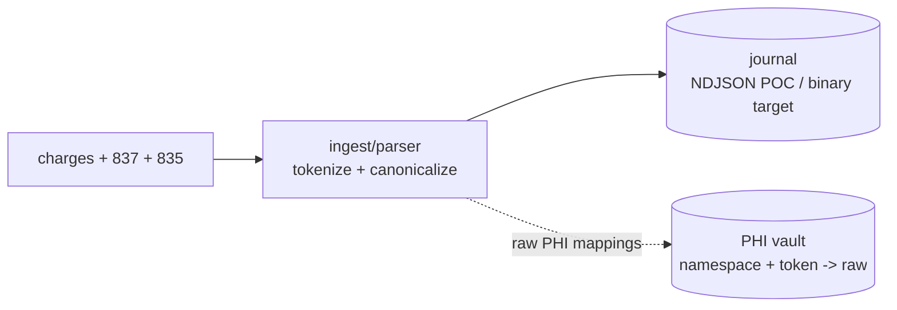
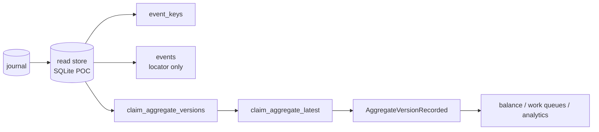

# scribe

Proof of concept for stitching provider charge context, 837 claims, and 835
remittances into versioned claim aggregates and ledger-style balance projections.

The main fixture is a synthetic stroke recovery encounter:

- Encounter: `ENC-SYN-STROKE-001`
- Patient: synthetic `ALEX REID`
- Story: CT without contrast, CT with contrast, MRI, rehab, neurology follow-up
- Fixtures:
  [tests/fixtures/stroke_encounter](https://github.com/AlexJReid/scribe/tree/main/tests/fixtures/stroke_encounter)

The PHI-looking values are fake synthetic data. The treatment shape reflects
stroke-related treatment I had in the UK; names, ids, payer details, dates,
amounts, and EDI content are not real PHI.

## Build

```sh
cmake -S . -B build
cmake --build build
ctest --test-dir build --output-on-failure
```

## Model

Current POC: NDJSON journal, SQLite read store, SQLite PHI vault.

Target: binary journal, pluggable read store. The read store owns indexes and
aggregate snapshots, not raw journal payloads.

**Figure 1: Ingest writes journal evidence and PHI vault mappings.**



**Figure 2: The read store indexes events and materializes aggregates.**



## Stroke demo

Create the journal and PHI vault:

```sh
build/scribe journal --out stroke.journal.ndjson \
  --phi-vault stroke_phi_vault.sqlite \
  --charges tests/fixtures/stroke_encounter/charge_transactions.ndjson \
  --837 tests/fixtures/stroke_encounter/facility_837.edi \
  --837 tests/fixtures/stroke_encounter/professional_837.edi \
  --837 tests/fixtures/stroke_encounter/rehab_837.edi \
  --837 tests/fixtures/stroke_encounter/neurology_837.edi \
  --835 tests/fixtures/stroke_encounter/facility_835.edi \
  --835 tests/fixtures/stroke_encounter/professional_835.edi \
  --835 tests/fixtures/stroke_encounter/rehab_835.edi \
  --835 tests/fixtures/stroke_encounter/neurology_835.edi
```

Stitch into the read store:

```sh
build/scribe stitch \
  --journal stroke.journal.ndjson \
  --encounter-id ENC-SYN-STROKE-001 \
  --read-store stroke_read_store.sqlite \
  --out stroke_aggregates.ndjson
```

`stroke_read_store.sqlite` gets:

- `event_keys`
- `events`
- `claim_aggregate_versions`
- `claim_aggregate_latest`

`stroke_aggregates.ndjson` is only an inspection/export stream.

Project balance:

```sh
build/scribe project --projection balance \
  --journal stroke.journal.ndjson \
  --encounter-id ENC-SYN-STROKE-001 \
  --out stroke_balance.json
```

Totals:

- Billed: `3720.00`
- Payer paid: `2340.00`
- Contractual adjustments: `830.00`
- Patient responsibility/current balance: `550.00`

## Read store

Aggregates are in SQLite:

```sh
sqlite3 -header -column stroke_read_store.sqlite "
select aggregate_id, version, state_json
from claim_aggregate_latest
order by aggregate_id;
"
```

Version history:

```sh
sqlite3 -header -column stroke_read_store.sqlite "
select version, updated_by_event_id, source_drop_id, state_json
from claim_aggregate_versions
where aggregate_id = 'claim:8259c238232f9585e95fc8f45b0bb410'
order by version;
"
```

Journal locator lookup:

```sh
sqlite3 -header -column stroke_read_store.sqlite "
select ek.event_id, e.source_drop_id, e.event_type, e.segment_id,
       e.event_offset, e.event_length
from event_keys ek
join events e on e.event_id = ek.event_id
where ek.key_type = 'payer_claim_control_number'
  and ek.key_value = 'edf29f09740ab104da309e2b036e14d1';
"
```

`events` stores locators only, never payload or aggregate state:

```text
event_id, source_drop_id, event_type, segment_id, event_offset, event_length, checksum
```

## PHI

Default path is non-PHI:

- names omitted
- claim/control ids tokenized
- aggregates keyed by tokens
- 837 `CLM01` and 835 `CLP01` share the `claim_id` namespace
- 835 `CLP07` uses `payer_claim_control_number`

```text
secret + namespace + raw value -> token
```

`SCRIBE_TOKEN_KEY` supplies the secret. Raw lookup goes through the vault:

```text
namespace + token -> raw value
```

HITRUST-zone apps may create/read PHI-containing aggregates deliberately with
`--include-phi --read-store`, or render PHI by resolving tokens through the
vault. Normal developer stores should stay tokenized.

SQLite may leave `*.sqlite-wal` and `*.sqlite-shm` files in WAL mode. They are
normal SQLite sidecars, not separate application artifacts.
