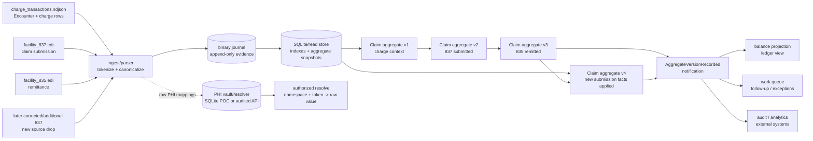

# scribe

`scribe` is a proof of concept for stitching provider-side charge context,
837 claim submissions, and 835 remittances into versioned claim aggregates and
ledger-style balance projections.

The main fixture is a synthetic stroke recovery encounter:

- Encounter: `ENC-SYN-STROKE-001`
- Patient: synthetic `ALEX REID`
- Clinical story: CT head without contrast, CT head with contrast, MRI brain,
  outpatient rehab, and neurology follow-up

The fixture is intentionally multi-claim. One encounter fans out into several
837/835 pairs, then the journal and stitcher bring them back together.

## Build

Only tested on macOS but Linux should work.

```sh
cmake -S . -B build
cmake --build build
ctest --test-dir build --output-on-failure
```

## Fixture

The fixture files live in the
[stroke_encounter fixture directory](https://github.com/AlexJReid/scribe/tree/main/tests/fixtures/stroke_encounter).

`charge_transactions.ndjson` is the upstream charge/encounter seed. In a real
pipeline, these rows would usually come from an EHR, charge capture system,
patient accounting system, or other provider-side revenue-cycle feed. This file
creates the encounter context and links each claim id back to
`ENC-SYN-STROKE-001`.

The X12 pairs are:

- `facility_837.edi` / `facility_835.edi`: facility imaging claim
- `professional_837.edi` / `professional_835.edi`: radiologist interpretation claim
- `rehab_837.edi` / `rehab_835.edi`: outpatient rehab claim
- `neurology_837.edi` / `neurology_835.edi`: neurology follow-up claim

Claim id linkage is through 837 `CLM01` and 835 `CLP01`. Payer control linkage
is through 835 `CLP07`.

## Build the journal

The journal is the immutable evidence stream. It is not one file per encounter,
and normal operation should not require replaying one giant journal. Source
drops (.edi files that appear out of band) are parsed and appended into a journal, while indexes provide random access.



For the stroke fixture:

```sh
build/scribe journal --out stroke.journal.ndjson \
  --phi-vault stroke_phi_vault.sqlite \
  --charges tests/fixtures/stroke_encounter/charge_transactions.ndjson \
  --837 tests/fixtures/stroke_encounter/facility_837.edi \
  --837 tests/fixtures/stroke_encounter/professional_837.edi \
  --837 tests/fixtures/stroke_encounter/rehab_837.edi \
  --837 tests/fixtures/stroke_encounter/neurology_837.edi \
  --835 tests/fixtures/stroke_encounter/facility_835.edi \
  --835 tests/fixtures/stroke_encounter/professional_835.edi \
  --835 tests/fixtures/stroke_encounter/rehab_835.edi \
  --835 tests/fixtures/stroke_encounter/neurology_835.edi
```

That command creates two artifacts:

- `stroke.journal.ndjson`: non-PHI journal events for the source drops
- `stroke_phi_vault.sqlite`: PHI resolver mappings, such as `claim_id + token`
  back to the raw claim id

Then derive aggregate snapshots for the encounter:

```sh
build/scribe stitch \
  --journal stroke.journal.ndjson \
  --encounter-id ENC-SYN-STROKE-001 \
  --out stroke_aggregates.ndjson
```

`stroke_aggregates.ndjson` contains versioned `ClaimAggregateUpdated` snapshots:
charge context as `v1`, matched 837 facts as `v2`, and matched 835 facts as
`v3`.

The journal is a binary segment log: append-only source evidence
with durable event ids, offsets, lengths, and checksums. You can always trace an
event/assertion back to an `.edi` file.

The current CLI emits NDJSON for inspection while the proof of concept is being
shaped. `--phi-vault` writes deterministic namespace/token/raw-value mappings
to a separate SQLite resolver database without putting raw PHI in the journal.

Indexes and aggregates live outside the journal in SQLite for now, but any
read store with fast lookup could fill that role. The important split is that
the journal is the immutable write/evidence path, while the read store is
versioned derived state.

## Stitch

`stitch` derives versioned claim aggregates from the journal:

```sh
build/scribe stitch \
  --journal stroke.journal.ndjson \
  --encounter-id ENC-SYN-STROKE-001 \
  --out stroke_aggregates.ndjson
```

Versions are compacted by source drop, not by every X12 segment:

- `v1`: charge/encounter context landed
- `v2`: matching 837 submission landed
- `v3`: matching 835 remittance landed
- `v4`: another later 835, correction, refund, or other new source drop landed

For example, the facility imaging claim reaches version 3 after the facility
835 has been applied:

```json
{"event_type":"ClaimAggregateUpdated","aggregate_type":"claim","aggregate_id":"claim:8259c238232f9585e95fc8f45b0bb410","version":3,"updated_by_event_type":"RemittanceAdjustmentObserved","update_scope":"source_drop","source_drop_id":"835:6","compacted_source_event_count":14,"keys":{"claim_id":"8259c238232f9585e95fc8f45b0bb410","payer_claim_control_number":"edf29f09740ab104da309e2b036e14d1","encounter_id":"ENC-SYN-STROKE-001"},"state":{"has_charge_context":true,"has_837":true,"has_835":true,"claim_type":"radiology_facility","claim_status_code":"1","source_event_count":29,"submitted_service_line_count":3,"remittance_service_line_count":3,"adjustment_count":6},"applied_event_ids":[2,3,4,13,14,15,16,17,18,19,20,21,22,23,24,65,66,67,68,69,70,71,72,73,74,75,76,77,78],"update_event_ids":[65,66,67,68,69,70,71,72,73,74,75,76,77,78]}
```

`applied_event_ids` means every journal event folded into this aggregate so far.
`update_event_ids` means only the events folded into this specific version. In
the NDJSON proof of concept these are 1-based journal line numbers; in the
binary journal they should become durable event ids or locators.

## Projecting a balance

As a demonstration of what can be reduced from a journal, the balance projection
reduces journal events into:

- encounter -> claim -> service line grouping
- billed charge ledger entries
- payer payment entries
- contractual adjustments
- patient responsibility
- patient payments, writeoffs, and refunds when present

Run it with:

```sh
build/scribe project --projection balance \
  --journal stroke.journal.ndjson \
  --encounter-id ENC-SYN-STROKE-001 \
  --out stroke_balance.json
```

Expected fixture totals:

- Total billed: `3720.00`
- Payer paid: `2340.00`
- Contractual adjustments: `830.00`
- Patient responsibility/current balance: `550.00`

## Random access

The storage split is:

- Binary journal: immutable source evidence
- SQLite/read store `source_drops`: one input file or batch
- SQLite/read store `events`: event id -> journal segment, offset, length, checksum
- SQLite/read store `event_keys`: claim id, payer control, encounter id -> event ids
- SQLite/read store `claim_aggregate_versions`: historical aggregate snapshots
- SQLite/read store `claim_aggregate_latest`: current aggregate snapshot
- PHI vault/resolver: namespace + token -> raw value, with separate access
  controls and audit

If an aggregate is deleted, it can be restored:

```text
claim id or encounter id
  -> SQLite event_keys
  -> event locators
  -> journal records
  -> rebuilt claim aggregate
```

A full journal replay is reserved for disaster recovery, for example if both
indexes and aggregates were deleted.

## PHI

The default stance is that the operational journal, indexes, aggregates, and
projections are non-PHI:

- direct names are omitted
- claim ids and control numbers are deterministically tokenized
- aggregate keys are tokenized, so developers can work against production-shaped
  data without seeing raw identifiers
- 837 `CLM01` and 835 `CLP01` use the same `claim_id` token namespace
- 835 `CLP07` uses the `payer_claim_control_number` token namespace

Tokenization is deterministic and namespaced. The tokenizer hashes:

```text
secret + namespace + raw value -> token
```

The secret comes from `SCRIBE_TOKEN_KEY`; the code has a development fallback
only for local tests. Production should provide this value from a secret manager
or equivalent. Namespacing is part of the join contract: `claim_id + X` and
`patient_id + X` intentionally produce different tokens, while 837 `CLM01` and
835 `CLP01` can match because both use the `claim_id` namespace.

The hash is not reversed. Raw-value resolution comes from the PHI vault mapping:

```text
namespace + token -> raw value
```

Raw PHI should not be stored in the primary journal or normal aggregate store.
Instead, ingestion can split the raw source facts into two paths:

```text
raw source document
  -> tokenized canonical event -> binary journal -> indexes/aggregates
  -> namespace + token + raw value -> PHI vault/resolver
```

For the proof of concept, the PHI vault is a separate SQLite database populated
with `scribe journal --phi-vault path.sqlite`. In production it could be an
audited resolver API. The interface should be the same either way:

```text
resolve(namespace, token) -> raw value
```

Examples:

```text
claim_id + 8259c238232f9585e95fc8f45b0bb410 -> CLM-STROKE-RAD-FAC-001
payer_claim_control_number + edf29f09740ab104da309e2b036e14d1 -> PAYER-STROKE-FAC-001
patient_id_name + 483f7b234ed109f0e2323052f22e4e59 -> REID|ALEX
```

Names are vaulted too. The vault stores deterministic name-token mappings such
as `patient_name`, `member_name`, `provider_name`, and `payer_name`. When an
NM1/N1 identifier is present, it also stores a convenience mapping from the
identifier token to the name, such as `patient_id_name + <patient_id_token>`.
Person names use X12 order, `LAST|FIRST`, to avoid ambiguity.

That resolver path should be access-controlled, audited, and unnecessary for
ordinary development or projection work. It can also be written on a separate
thread from journal append as long as the source drop records enough provenance
to repair or re-drive vault writes.

Use `--phi-vault` to populate raw mappings while keeping the journal non-PHI:

```sh
build/scribe journal --out stroke.journal.ndjson \
  --phi-vault stroke_phi_vault.sqlite \
  --charges tests/fixtures/stroke_encounter/charge_transactions.ndjson \
  --837 tests/fixtures/stroke_encounter/facility_837.edi \
  --835 tests/fixtures/stroke_encounter/facility_835.edi
```

Resolve only when an authorized workflow needs raw PHI:

```sh
build/scribe vault-resolve \
  --phi-vault stroke_phi_vault.sqlite \
  --namespace claim_id \
  --token 8259c238232f9585e95fc8f45b0bb410 \
  --actor analyst@example.test \
  --purpose claim-review
```

Each resolve attempt writes an audit row in the vault database.

Use `--include-phi` only for local debugging. It emits raw identifiers and names
into the journal output and should not be part of the normal production path.
With `--include-phi`, raw identifiers and names are emitted where available, and
token companion fields such as `claim_id_token` and
`payer_claim_control_number_token` are included so the PHI view can still be
linked to non-PHI projections.

## Other commands

The parser can still emit raw mapped events for individual files:

```sh
build/scribe parse --type 837 tests/fixtures/sample_837.edi --out events_837.ndjson
build/scribe parse --type 835 tests/fixtures/sample_835.edi --out events_835.ndjson
build/scribe parse --type 834 tests/fixtures/sample_834.edi --out events_834.ndjson
```

For `parse`, `stitch`, and `project`, use `--out -` or omit `--out` for stdout.
`journal` currently requires an explicit `--out` path.
