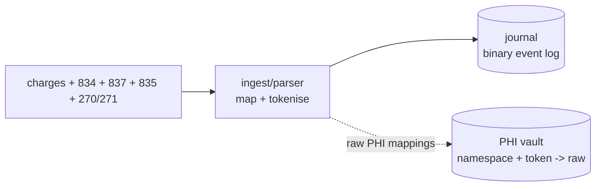
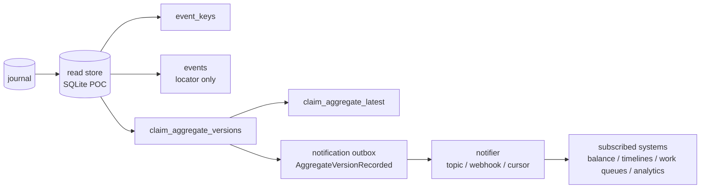
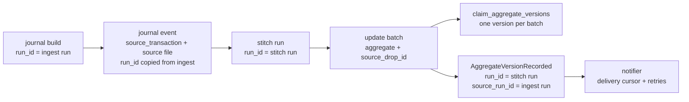

# scribe deep dive

`scribe` is about joining the parts of a healthcare money trail that usually
arrive as separate files:

- provider charges: local context about work performed
- 834 enrollment: member and coverage change context
- 270/271 eligibility: coverage questions and payer answers at a point in time
- 837 claims: provider-to-payer claim submissions
- 835 remittances: payer-to-provider adjudication and payment detail

The proof of concept turns those inputs into an immutable journal. The claim
money trail reduces into versioned claim aggregates and balance projections;
coverage/member events are journaled for a future `member_coverage` aggregate.
PHI-bearing values are [tokenised](#phi) before they enter the normal
journal/read-store path, with raw values held separately in a PHI vault.

The stroke case study uses synthesized PHI-looking data. It is inspired by the
broad shape of a stroke-related episode I had in the UK, outside the US
healthcare system; the encounter is mocked up, and the names, IDs, payer
details, dates, amounts, and EDI content are invented.

## 837/835

An 837 says *what* was claimed. In this project it contributes claim identity,
encounter context, patient/subscriber/provider fields, service lines, billed
amounts, and source locators.

An 835 says *how* the payer adjudicated the claim. It contributes payer control
numbers, paid amounts, adjustments, patient responsibility, remittance status,
and source locators.

A useful aggregate appears only after those views are stitched together:

```text
charges + 837 claim + 835 remittance -> claim aggregate versions
claim aggregate versions -> balance / timelines / work queues
```

837 `CLM01` and 835 `CLP01` deliberately share the `claim_id` namespace so
submissions and remittances can meet without exposing raw identifiers. 835
`CLP07` uses the `payer_claim_control_number` namespace because it is a
different identifier with a different matching role.

## Coverage/member context

Coverage context is journaled as its own evidence stream and should be reduced
as its own aggregate rather than being folded into the claim aggregate:

```text
834 enrollment + 270 eligibility inquiry + 271 eligibility response
    -> member_coverage aggregate versions
```

The aggregate should be member-centric and temporal. 834 contributes enrollment
or roster truth over time. 270 records the eligibility question that was asked.
271 records the payer answer at a point in time, including service type and
benefit details when present.

`member_coverage` should keep source locators and distinguish effective dates,
termination dates, inquiry dates, and response/as-of dates. Claim workflows can
consult it by member token, payer token, service date, and service type, while
claim aggregates stay focused on charges, 837 submissions, and 835 remittances.

## Model

Current proof of concept:

- Journal: immutable binary evidence stream
- PHI vault: separate resolver for `namespace + token -> raw`
- Coverage/member context events from 834 enrollment and 270/271 eligibility
- Indexes: claim, payer control, encounter, and event locator lookup
- Aggregate snapshot store: versioned claim state plus latest claim state
- Notification outbox: durable, non-PHI aggregate version facts for downstream
  systems

SQLite backs the vault, indexes, and snapshots in this proof of concept. It is
standing in for a managed database or document store.





## Runs and notifications

Each execution should have a `run_id`. The journal should carry it on every
event produced by that run so later scans can tie a claim aggregate version back
to the ingest/stitch execution that caused it. The run id is operational
metadata, not a PHI field.

Notification delivery is separate from aggregate construction. Stitching writes
durable aggregate versions and may write a small JSON outbox fact such as
`AggregateVersionRecorded`; a notifier process then scans from its last file
offset, read-store cursor, or outbox row and sends downstream notifications.
The JSON outbox is derived/replayable and non-PHI; the source evidence remains
the binary journal.



The run fields have different meanings:

- `run_id` on journal events identifies the ingest execution that wrote the
  source evidence.
- `run_id` on aggregate updates and notifications identifies the stitch
  execution that produced the derived version.
- `source_run_id` on aggregate updates and notifications is copied from the
  journal events in the current source drop, so consumers can trace a derived
  version back to the ingest run.
- `source_drop_id` identifies the source file/transaction group being reduced.
  The stitcher batches updates by `(aggregate, source_drop_id)`, flushes when
  the source drop changes or the journal ends, and emits one aggregate version
  plus one notification for that batch.
- `updated_by_event_id`, `updated_by_event_type`, and journal offset/length point
  to the last source event that changed the aggregate inside the batch.

The notification payload should stay small and tokenised:

```json
{
  "event_type": "AggregateVersionRecorded",
  "ok": true,
  "notification_id": "claim:8259c238232f9585e95fc8f45b0bb410:3",
  "run_id": "stroke-stitch-demo",
  "source_run_id": "stroke-ingest-demo",
  "aggregate_type": "claim",
  "aggregate_id": "claim:8259c238232f9585e95fc8f45b0bb410",
  "version": 3,
  "source_drop_id": "835:6",
  "updated_by_event_id": 128,
  "updated_by_event_type": "RemittanceDateRecorded",
  "updated_by_journal_offset": 8172,
  "updated_by_journal_length": 612
}
```

Downstream systems should use `(aggregate_id, version)` as an idempotency key.
Delivery retries, webhook failures, subscriber offsets, and dead-letter handling
belong to the notifier, not the stitcher. The stitcher owns the fact that a new
aggregate version exists; the notifier owns transport.

## Why

- Immutable journal for parsed 837/835 inputs
- Source file locators on events for audit and replay
- Early PHI split so tokenised data can move through normal dev and analytics
  paths
- Deterministic tokens for matching without raw PHI
- Pluggable key rules so 837, 835, charges, and vendor variants can choose
  different matching inputs
- Journal reductions can answer state as of T
- Pre-calculated claim snapshots are one read for consuming apps
- New versions create a durable "new version exists" signal for subscribers,
  then a separate notifier delivers it from a cursor
- SQLite stays a compact stand-in for read stores and vaults

## PHI

Default path is non-PHI:

- names omitted
- claim/control IDs tokenised
- aggregates keyed by tokens
- long text fields that may contain PHI can use the same token path

```text
secret + namespace + raw value -> token
namespace + token -> raw value
```

Token mechanics:

- HMAC-SHA256 gives deterministic keyed tokens for matching without raw PHI
- The HMAC input is `namespace + ":" + raw value`
- The key comes from `SCRIBE_TOKEN_KEY`
- The output token is the first 16 bytes of the digest as 32 lowercase hex chars
- Shortened tokens keep JSON, SQLite keys, and aggregate IDs compact
- Namespaces stop unrelated values sharing a token
- Hashing is not encryption; raw values can only be resolved through the vault

PHI-containing read stores are PHI. Treat every PHI extract as a controlled
dataset with owner, purpose, expiry, retention, encrypted storage, and audited
access. Prefer minimal purpose-built read stores over copying the whole vault.

HITRUST-zone apps may deliberately create/read PHI-containing aggregates with
`--include-phi --phi-vault --read-store`, or render PHI by resolving tokens
through the vault. Normal developer stores should stay tokenised.

## Balance example

Synthetic PHI view. The care pattern is inspired by a UK, non-US healthcare
episode I had, but the patient, identifiers, payer details, dates, amounts, and
EDI content are invented and the encounter is mocked up. This is a balance
projection over the journal, not a single `claim_aggregate_latest` row.

```text
Encounter: ENC-SYN-STROKE-001
Patient:   ALEX REID

Claim                         Type                    Billed   Paid    PR
CLM-STROKE-RAD-FAC-001        radiology_facility      2350.00  1450.00 350.00
CLM-STROKE-RAD-PRO-001        radiology_professional   390.00   260.00  40.00
CLM-STROKE-REHAB-001          outpatient_rehab         660.00   420.00 120.00
CLM-STROKE-NEURO-001          neurology_followup       320.00   210.00  40.00

Totals: billed 3720.00, paid 2340.00, PR/current balance 550.00
```
