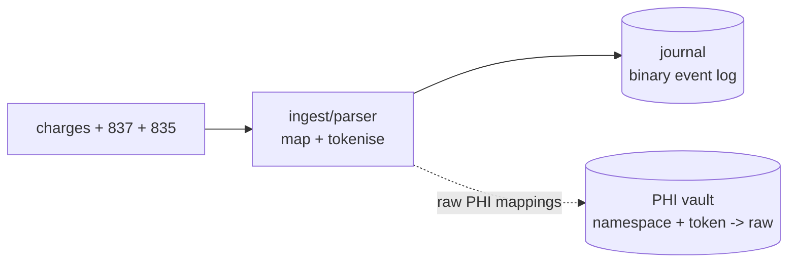
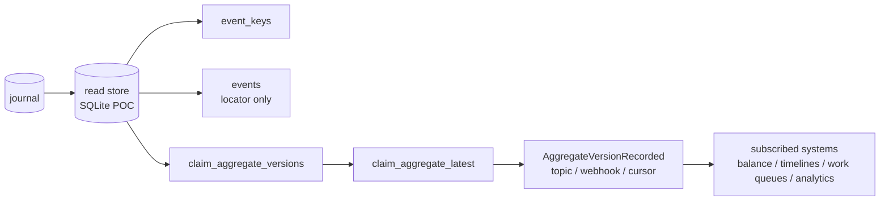

# Theory

`scribe` is about joining the parts of a healthcare money trail that usually
arrive as separate files:

- provider charges: local context about work performed
- 837 claims: provider-to-payer claim submissions
- 835 remittances: payer-to-provider adjudication and payment detail

The proof of concept turns those inputs into an immutable journal, then reduces
the journal into versioned claim aggregates and balance projections. PHI-bearing
values are [tokenised](#phi) before they enter the normal journal/read-store
path, with raw values held separately in a PHI vault.

The stroke case study uses synthesized PHI-looking data. It is inspired by the
broad shape of a stroke-related episode I had in the UK, outside the US
healthcare system; the names, IDs, payer details, dates, amounts, and EDI
content are invented.

## 837 And 835

An 837 says what was claimed. In this project it contributes claim identity,
encounter context, patient/subscriber/provider fields, service lines, billed
amounts, and source locators.

An 835 says how the payer adjudicated the claim. It contributes payer control
numbers, paid amounts, adjustments, patient responsibility, remittance status,
and source locators.

The useful aggregate appears only after those views are stitched together:

```text
charges + 837 claim + 835 remittance -> claim aggregate versions
claim aggregate versions -> balance / timelines / work queues
```

837 `CLM01` and 835 `CLP01` deliberately share the `claim_id` namespace so
submissions and remittances can meet without exposing raw identifiers. 835
`CLP07` uses the `payer_claim_control_number` namespace because it is a
different identifier with a different matching role.

## Model

Current proof of concept:

- Journal: immutable binary evidence stream
- PHI vault: separate resolver for `namespace + token -> raw`
- Indexes: claim, payer control, encounter, and event locator lookup
- Aggregate snapshot store: versioned claim state plus latest claim state

SQLite backs the vault, indexes, and snapshots in this proof of concept. It is
standing in for a managed database or document store.





## Why This Shape

- Immutable journal for parsed 837/835 inputs
- Source file locators on events for audit and replay
- Early PHI split so tokenised data can move through normal dev and analytics
  paths
- Deterministic tokens for matching without raw PHI
- Pluggable key rules so 837, 835, charges, and vendor variants can choose
  different matching inputs
- Journal reductions can answer state as of T
- Pre-calculated claim snapshots are one read for consuming apps
- New versions can emit a small "new version exists" signal for subscribers
- SQLite stays a compact stand-in for read stores and vaults

## PHI

Default path is non-PHI:

- names omitted
- claim/control IDs tokenised
- aggregates keyed by tokens
- long text fields that may contain PHI can use the same token path

```text
secret + namespace + raw value -> token
namespace + token -> raw value
```

Token mechanics:

- HMAC-SHA256 gives deterministic keyed tokens for matching without raw PHI
- The HMAC input is `namespace + ":" + raw value`
- The key comes from `SCRIBE_TOKEN_KEY`
- The output token is the first 16 bytes of the digest as 32 lowercase hex chars
- Shortened tokens keep JSON, SQLite keys, and aggregate IDs compact
- Namespaces stop unrelated values sharing a token
- Hashing is not encryption; raw values can only be resolved through the vault

PHI-containing read stores are PHI. Treat every PHI extract as a controlled
dataset with owner, purpose, expiry, retention, encrypted storage, and audited
access. Prefer minimal purpose-built read stores over copying the whole vault.

HITRUST-zone apps may deliberately create/read PHI-containing aggregates with
`--include-phi --phi-vault --read-store`, or render PHI by resolving tokens
through the vault. Normal developer stores should stay tokenised.

## Balance Example

Synthetic PHI view. The care pattern is inspired by a UK, non-US healthcare
episode I had, but the patient, identifiers, payer details, dates, amounts, and
EDI content are invented. This is a balance projection over the journal, not a
single `claim_aggregate_latest` row.

```text
Encounter: ENC-SYN-STROKE-001
Patient:   ALEX REID

Claim                         Type                    Billed   Paid    PR
CLM-STROKE-RAD-FAC-001        radiology_facility      2350.00  1450.00 350.00
CLM-STROKE-RAD-PRO-001        radiology_professional   390.00   260.00  40.00
CLM-STROKE-REHAB-001          outpatient_rehab         660.00   420.00 120.00
CLM-STROKE-NEURO-001          neurology_followup       320.00   210.00  40.00

Totals: billed 3720.00, paid 2340.00, PR/current balance 550.00
```
